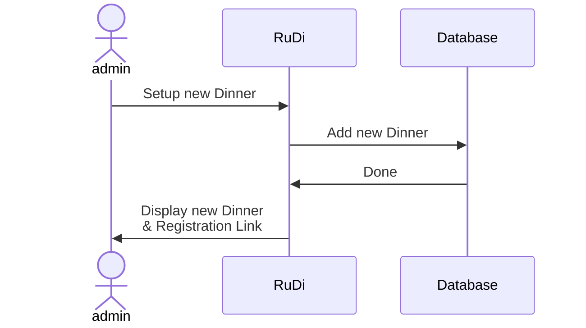
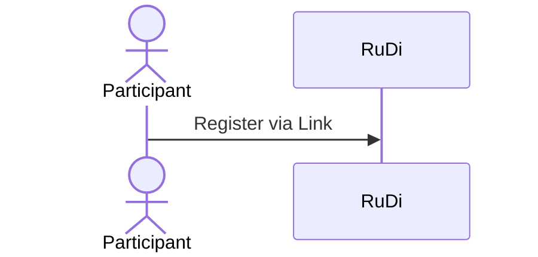

# Setup a Dinner

```mermaid
sequenceDiagram
    actor admin
    participant rudi as RuDi
    participant db as Database
    
    admin->>rudi: Setup new Dinner
    rudi->>db: Add new Dinner
    db->>rudi: Done
    rudi->>admin: Display new Dinner <br> & Registration Link
```

# Register for a Dinner

```mermaid
sequenceDiagram
    actor user as Participant
    participant rudi as RuDi

    user ->> rudi: Register via Link
```
# Create Dinner Plan